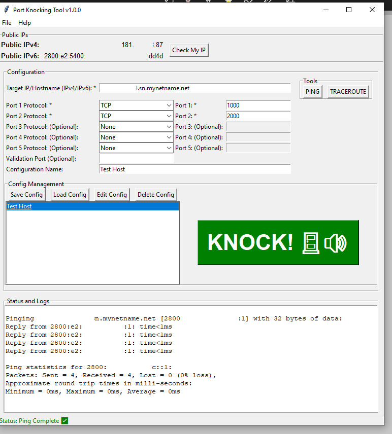
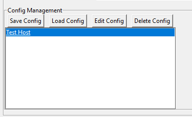
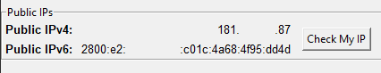
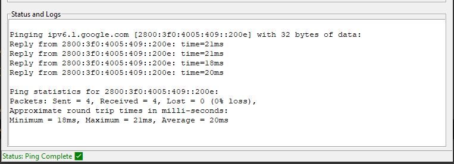
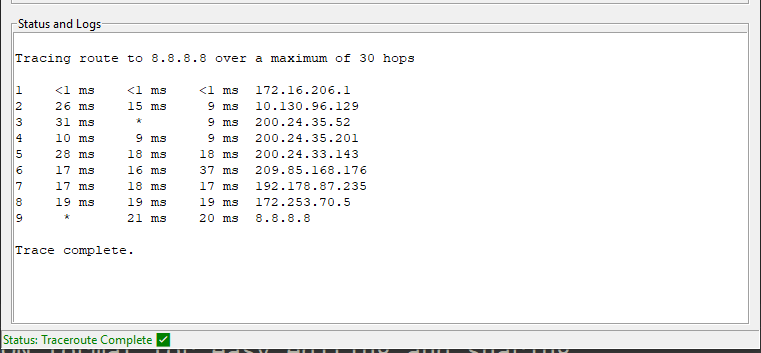
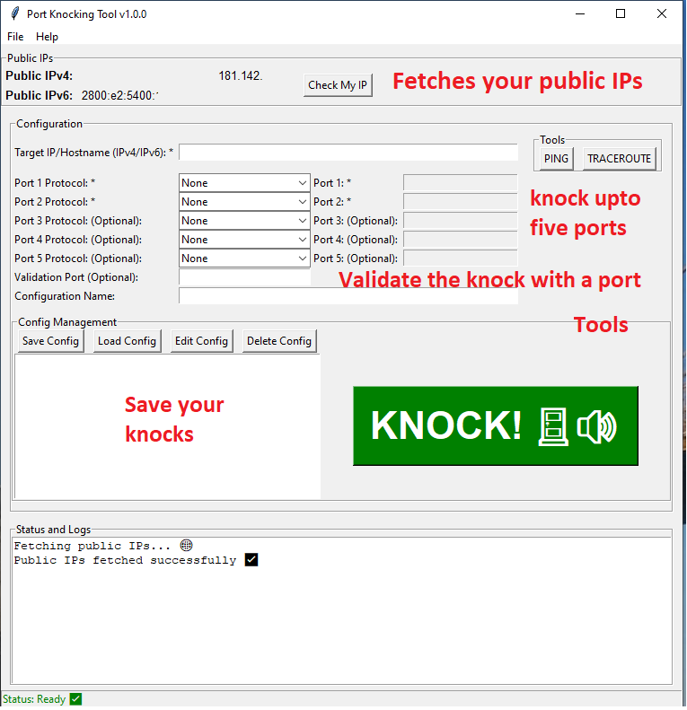

# PortknockingUtility v1.0.0

We are excited to announce the initial release of PortknockingUtility, a comprehensive tool designed to perform port knocking on a target host, manage network configurations, and run network diagnostics.

## Features

### Port Knocking
- Configure and send packets to specific ports on a target host.
- Save, load, edit, and delete configurations for repeated use.
- Validate the knock sequence with an optional validation port.



### Configuration Management
- Save your network configurations with a custom or autogenerated name.
- Easily load, edit, and delete saved configurations.



### Public IP Display
- Fetch and display your public IPv4 and IPv6 addresses.
- Simple interface to check current public IP addresses.



### Network Diagnostics
- Ping: Send ICMP echo requests to diagnose network reachability.
- Traceroute: Trace the route packets take to reach the target host.




### User-Friendly Interface
- Intuitive GUI built with Tkinter.
- Real-time status and log updates.
- Configurations saved in JSON format for easy editing and sharing.



## Installation

### Download the Installer
- Download the installer from the following link: [PortknockingUtilityInstaller.exe](https://github.com/davidgonzalezh/PortKnock/blob/main/release/PortKnockUtilitySetup.exe).
- Run the installer and follow the on-screen instructions to install PortknockingUtility on your system.

## Usage

1. **Public IPs**: Click "Check My IP" to fetch and display your public IPv4 and IPv6 addresses.
2. **Configuration**: Enter the target IP/Hostname and configure up to 5 ports and protocols.
3. **Tools**: Use the "PING" and "TRACEROUTE" buttons for network diagnostics.
4. **Config Management**: Save, load, edit, or delete configurations.
5. **Logs and Status**: View real-time logs and status updates in the dedicated section.


## Configuration File

Configurations are saved in a JSON file (`configurations.json`) with the following format:

```json
[
    {
        "configuration_name": {
            "ip": "target_ip_or_hostname",
            "ports": [
                ["protocol1", "port1"],
                ["protocol2", "port2"],
                ["protocol3", "port3"],
                ["protocol4", "port4"],
                ["protocol5", "port5"]
            ],
            "validation_port": "validation_port"
        }
    }
]
```

### Note: If the ports do not show correctly when you load a configuration, double-click the configuration host in the list, and the ports will display correctly.

## Help

Access detailed help and instructions through the "Help" menu item in the application or refer to the help.txt file included with the application.

## Feedback

We welcome your feedback and suggestions to improve PortknockingUtility. Please contact us at your-email@example.com.

Visit our website: (www.lambdastrategies.com)

## License

This project is licensed under the MIT License. See the LICENSE file for details.

Thank you for using PortknockingUtility!